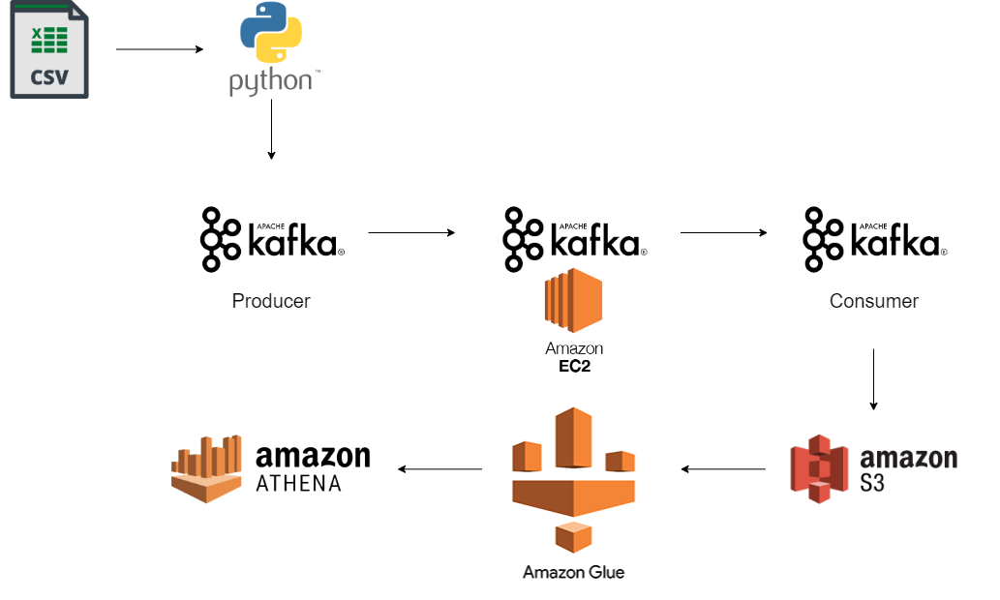

# Kafka stream processing project

## Introduction

This project focus on using Apache Kafka, to seamlessly bridge the gap between data producers and consumers. Primary goal is to enable the real-time processing of data efficiently with the ability to process, analyze, and gain insights from live data streams efficiently and reliably.

dataset: https://www.kaggle.com/datasets/joelhanson/coronavirus-covid19-data-in-the-united-states?select=us-counties-2023.csv

## Data Architecture Diagram

## Project Steps

**Step 1: Acquiring Real-Time Data:**

Use data source(Covid-19_Data_USA_2023) which represents real-time information from an API. This dataset forms the foundation of our project, providing the essential data feed.

**Step 2: Setting Up the Environment:**

Using AWS EC2 instance as a virtual server. This step involves creating the ideal environment for Apache Kafka, ensuring a seamless experience for data transmission and processing.

**Step 3: Implementing Kafka Producers and Consumers:**

We craft custom Python code to execute Kafka producers and consumers. These components serve as the bridge connecting our data source to the Kafka platform, ensuring a continuous flow of real-time data.

**Step 4: Data Storage with AWS S3:**

For efficient data management, we configure an AWS S3 bucket. This bucket acts as the repository for data generated by our Kafka consumers. It ensures data persistence, accessibility, and reliability.

**Step 5: Building AWS Glue and Crawler for AWS Athena:**

To enable advanced data analytics and querying, we set up AWS Glue and create crawlers to automate data cataloging. This step prepares our data for seamless integration with AWS Athena, a powerful querying service.

**Step 6: Real-Time Data Processing:**

Set up the Kafka producer and consumer into motion. Real-time data from our dataset is efficiently transported to AWS Athena, where it's readily available for performing essential real-time tasks, analytics, and insights.

